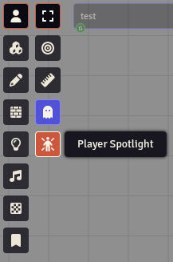
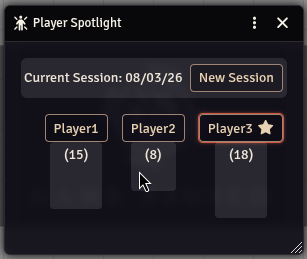

# fvtt-player-spotlight

A foundryVTT module that helps GMs track who is getting the spotlight during sessions and campaigns.

## Installation:

<!-- TODO: explain what URL for the module should be used to install it -->

## Features

> Note: Not all features listed here are available.
>
> Features that are planned but not yet implemented are noted by a `🔜` symbol

### Keep an eye on the spotlight

Click the spotlight icon on the right of the player list, to display the `Spotlight Tracker` window.

Once open, you will have access to an up-to-date view on how the spotlight is being shared across your players:

#### 🔜 Tracking your game

We offer two view modes that you can toggle:

- `Campaign Mode`: shows all the data available. Highlighting the portion that corresponds to the current session. 
- `Session Mode`: shows only the data for the current session.

<!-- TODO: show screenshot of this feature. -->

#### Choose a spotlight

To help you determine who should receive the spotlight next, we offer two modes:

- `Queue mode`: Whenever a player receives a spotlight, it will be moved to the end of the list. This means that players at the start of the list are the ones that should be considered for a spotlight next!
- `Stable mode`: Players are sorted by their names, so clicking them will not reorder the list. In this case, you can track the overall count of spotlights, and watch the `spotlight` icon to see who received the spotlight last.

<!-- TODO: show the icon and screenshots here. Compare the two functionalities. Consider a video to showcase the feature in action. -->

### 🔜 Track sessions

When you start a new session, you can press the `New session` button. This will start a new, clean, tracker for the current session.

Optionally, this can be done automatically when the date changes.

### Track when you spotlight a player 

You can *left-click* a player card to indicate they received a spotlight, or *right-click* them to remove or undo a spotlight.

Clicking a player card will always register the spotlight on the most recently created session.

### 🔜 Show and hide players quickly

If you share a world between multiple groups, you can show and hide specific players quickly, reducing the visual noise and keeping the interface clean for you.

To do so, you can *right-click* on the players list and `Track spotlight`/`Hide spotlight` for the current session.

#### 🔜 Create group templates

If you frequently switch between groups, you can create **Group templates** and quickly activate them.

This makes tracking and hiding players a one-click action instead of going manually thru each one.

## Contributing

This project is fully open source and open to external contributions.

You can contribute by reporting bugs, suggesting features, and submitting Pull Requests with improvements and fixes.

### AI use

This project does **not** accept AI-generated content, reports or code.

The use of AI assistance (where the majority of the work is performed by a human, and any AI-generated output is validated by a human) should be disclosed explicitly.